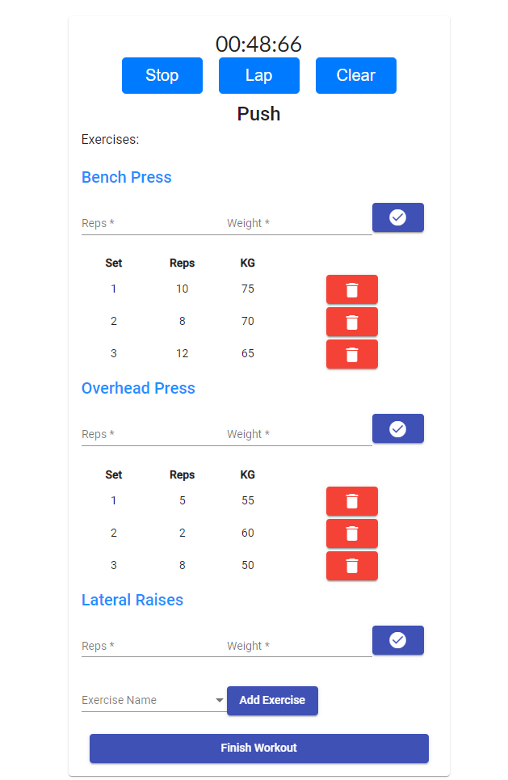

# GainsTracker Angular Frontend

GainsTracker is a web application where you can easily track your workouts.
I used Angular for the frontend and Java Spring for the backend with a Postgres database

This is the Start Workout page where you can choose to start an empty workout or choose from template

Templates are made to easily follow your routine without redundantly adding your exercises each time

You are able to create exercise templates and workout templates to easily routinize your workout

Start a workout from template

This is how you can add exercises to the workout session

And this is a list of the finished workouts

